# Using in NOMAD GUI

This tutorial shows how to use the AIF parser plugin within the NOMAD GUI environment.

## Overview

The AIF parser plugin integrates seamlessly with NOMAD's graphical user interface. This guide walks you through the complete workflow from uploading AIF files to searching and visualizing the parsed data.

## Prerequisites

Before starting, ensure you have:

- A NOMAD instance with the AIF parser plugin installed
- A web browser with access to your NOMAD GUI
- AIF files to upload and parse

## Step-by-Step Guide

### Upload And Process AIF Files

#### Step 1: Upload AIF Files

- Login and navigate to the NOMAD GUI dashboard ("Publish")


- Click on the "Publish -> Upload" button in the main navigation bar

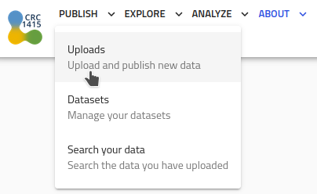

- Click on the "Create a new Upload" button

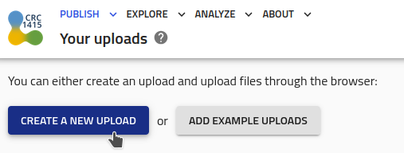

- Provide a "Upload title" (here: 'AIF-Parser')

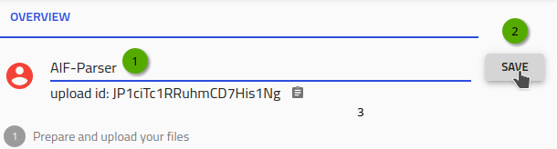

- Choose your AIF file(s) from your local system and "Drag & Drop" them to the upload

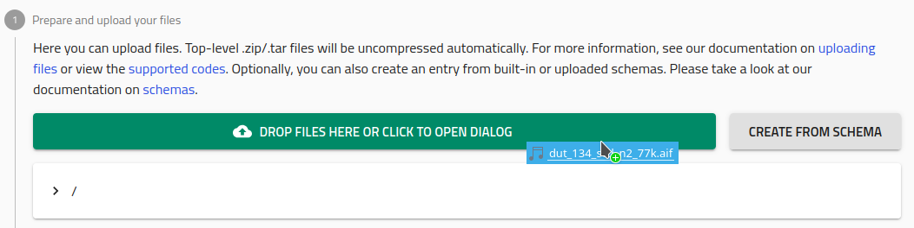

- The upload will begin and the parsing of the .aif (1) creates a NOMAD `.archive.json` file (2)

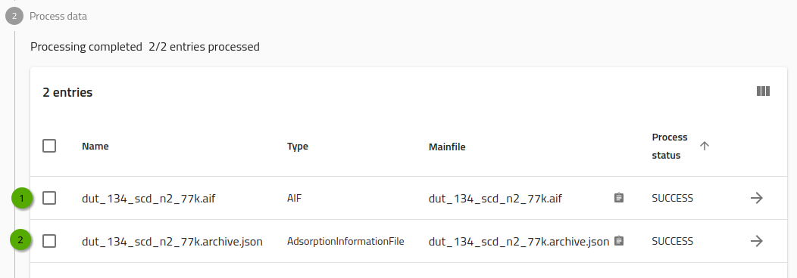

#### Step 2: Automatic Parsing

1. After upload completes, NOMAD automatically processes the AIF file using the installed parser
2. The parsing happens in the background - you'll see a processing indicator
3. Once complete, you'll see a "Process Status" confirming successful parsing

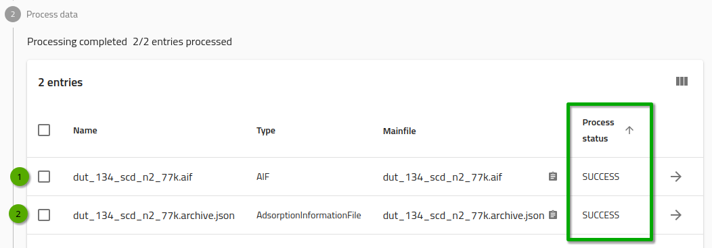

- The parsed data becomes available in the NOMAD data model

#### Step 3: Edit Visibility and Access (optional)

- As default, all data in the upload can only be access by the user
- To provide read-access to everybody, select the checkbox in section "Edit visibility and access"
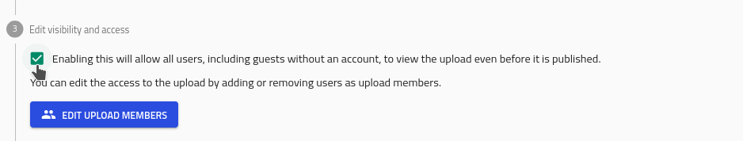
- Additional, you may also provide dedicated read-only or read/write access to specific user or groups use the "Edit Upload Members" button
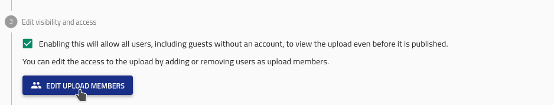

#### Step 4: View Parsed Data

1. Navigate to your "Upload" in the GUI
2. Locate your newly parsed AIF data in the list
3. Click on the arrow next to `.archive.json` file to view its details

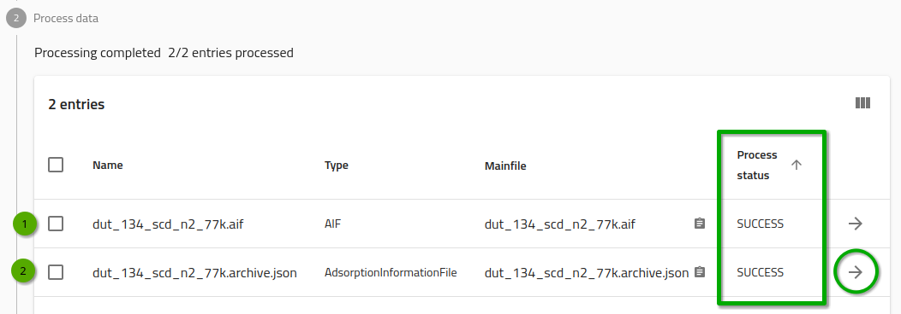

- The GUI displays the structured data extracted from your AIF file

### Visualize Data

- Select a entry to view its adsorption data
- In case you have write access all fields can be modified (dark grey background)
- The GUI automatically generates plots of:  

    * Adsorption isotherms
    * Desorption isotherms
    * Relative pressure vs loading relationships

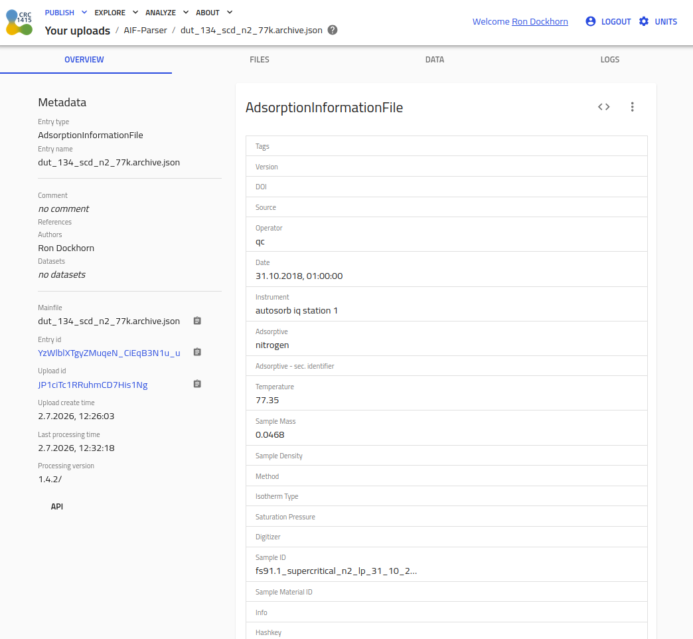

- Interactive plots allow zooming and data inspection

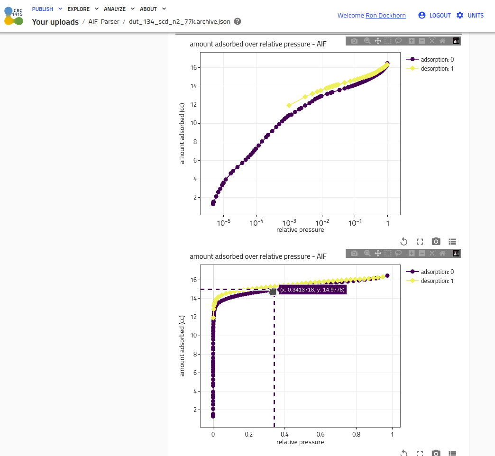

### Search and Query

#### Step 1: Explore the AIF Entries

- Login and navigate to the NOMAD GUI dashboard ("Explore")


- Click on the "Explore -> Adsorption Information File" button in the main navigation bar

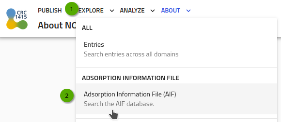

#### Step 2: Query the AIF Entries

- Use the search interface to find specific AIF data
- Enter search criteria such as:
    
    * Operator name
    * Adsorptive substance
    * Temperature conditions
    * Sample material ID
    * Chemical composition

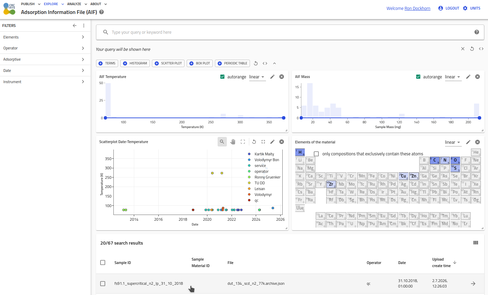

- Apply filters to narrow down results
- Use the search for specific AIF data using NOMAD's query language:

```bash
# Find all experiments with a specific operator
data.aif_operator#aifparser.schema_packages.aif_schema_package.AdsorptionInformationFile == "TU DD"

# Search for experiments with specific adsorptive
aif_adsorptive == N2

# Find experiments with temperature data
data.aif_temperature = *

# Find experiments with a range
60 mg <= data.aif_sample_mass <= 140 mg
```
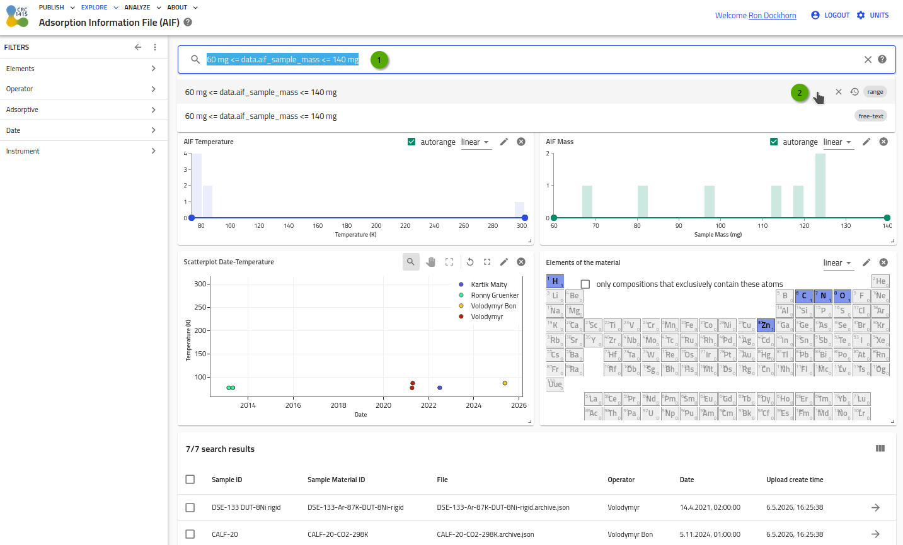

## Advanced Features

### Data Exploration

1. Click on individual data points to see detailed information
2. Use the filtering options to compare different datasets
3. Export data for further analysis in external tools

### Metadata Management

1. View all metadata fields extracted from the AIF file, see [Reference section](../reference/references.md)
2. Edit metadata if needed (depending on your NOMAD configuration and r/w access)
3. Use metadata for advanced searching and categorization

## Troubleshooting

### Common Issues

1. **Upload failures**: Check file format and size limits
2. **Parsing errors**: Verify AIF file validity and plugin installation
3. **Missing data**: Ensure all required metadata fields are present in the AIF file

### Contact Support

If you encounter persistent issues, contact your NOMAD administrator or reach out to:

- Ron Dockhorn <ron.dockhorn@tu-dresden.de>

## Next Steps

After successfully using the AIF parser in the GUI:

1. Explore advanced search capabilities
2. Learn about data export options
3. Investigate integration with other NOMAD plugins
4. Consider contributing to the AIF format specification
